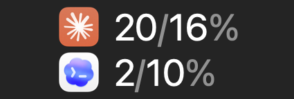
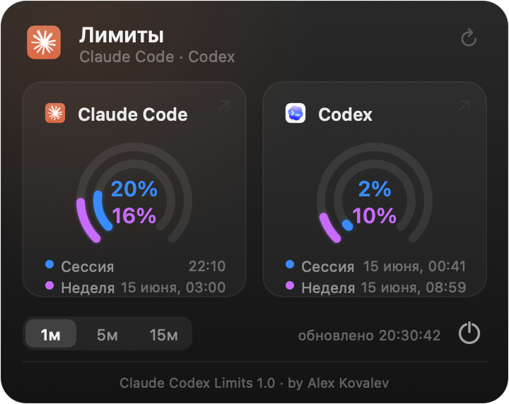

# Claude Codex Limits

[English](README.md) · **Русский**

Маленькое приложение для строки меню macOS, которое показывает, сколько у вас осталось
лимитов **Claude Code** и **Codex** — одним взглядом, прямо в верхнем трее.

В каждой строке — `сессия% / неделя%` (скользящее 5‑часовое окно и 7‑дневное окно),
слева иконка продукта. По клику на иконку в трее открывается подробная панель.

<p align="center">
  
  &nbsp;&nbsp;
  
</p>

## Возможности

- **Два продукта — один взгляд.** Claude Code (рыжий) над Codex, проценты `сессия / неделя`.
- **Цветовые предупреждения.** Цифры и кольца желтеют при ≥50% и краснеют при ≥80% лимита.
- **Подробная панель.** Клик по иконке — кольцевые гейджи, точные проценты, время сброса.
- **Клик по карточке** открывает страницу с лимитами в браузере.
- **Интервал обновления** — 1 / 5 / 15 минут на выбор.
- **Светлая и тёмная** строка меню, чётко на retina.
- **Автозапуск при входе**, без иконки в Dock, без сторонних зависимостей.

## Как это работает

**Claude Code** (лимиты подписки). Приложение читает ваши существующие OAuth‑креденшелы
Claude Code из связки ключей macOS (`Claude Code-credentials`), обновляя access‑токен
ровно так же, как это делает CLI Claude Code, и запрашивает эндпоинт использования
Anthropic `GET /api/oauth/usage`. **Это не тратит вашу квоту** — берутся только
`five_hour.utilization` (сессия) и `seven_day.utilization` (неделя).

**Codex** (OpenAI). Codex пишет свои лимиты в локальные журналы сессий
(`~/.codex/sessions/**/rollout-*.jsonl`). Приложение читает самую свежую запись
`rate_limits`: `primary` — 5‑часовое окно, `secondary` — 7‑дневное. Эти значения
актуальны на момент вашего последнего запроса к Codex — если вы давно его не запускали,
панель об этом сообщит.

Никуда ничего не отправляется, кроме авторизованного запроса использования в Anthropic
(от вашего имени). Никакой телеметрии и сторонних сервисов. Рантайм‑кэш и резервная копия
креденшелов хранятся в `~/.claude-limits-monitor/`.

## Установка

### Из .dmg

1. Скачайте `ClaudeCodexLimits-1.0.dmg` со страницы [Releases](../../releases).
2. Откройте и перетащите **Claude Codex Limits** в **Applications**.
3. Запустите. Сборка не нотаризована, поэтому в первый раз может понадобиться
   правый клик → **Открыть** или разрешение в **Системных настройках → Конфиденциальность и безопасность**.
4. Иконка появится справа в строке меню.

### Из исходников

```bash
git clone https://github.com/ArrivaRUS/claude-codex-limits.git
cd claude-codex-limits
./install.sh        # собрать, поставить в /Applications, включить автозапуск, запустить
```

Требуется: macOS 13+, командные инструменты Xcode (`swiftc`). Ставить пакеты не нужно.

## Использование

- **Левый клик** по иконке в трее → открыть/закрыть панель.
- **Клик по карточке** → открыть страницу лимитов продукта в браузере.
- **Кнопка обновления** (вверху справа панели) → обновить сейчас.
- **Пилюли интервала** (внизу) → 1 / 5 / 15 минут.
- **Кнопка выключения** (внизу справа) → выход.
- **Правый клик** по иконке → запасное меню (Обновить / Автозапуск / Выйти).

## Сборка релиза

```bash
./scripts/make-dmg.sh     # → dist/ClaudeCodexLimits-1.0.dmg
```

## Структура проекта

```
Sources/LimitsMonitor.swift   всё приложение (Foundation + AppKit + CoreText)
Resources/*.png               иконки брендов
build.sh                      сборка .app в dist/
install.sh                    сборка + установка + автозапуск
scripts/make-dmg.sh           упаковка .dmg
docs/                         скриншоты
```

## Приватность и безопасность

Приложение читает только **ваши собственные** локальные креденшелы и журналы и общается
только с API Anthropic от вашего имени. Оно не содержит и не передаёт секретов. Исходник —
один читаемый Swift‑файл, его можно прочитать. Используйте на своё усмотрение.

## Лицензия

[MIT](LICENSE) © 2026 Alex Kovalev
